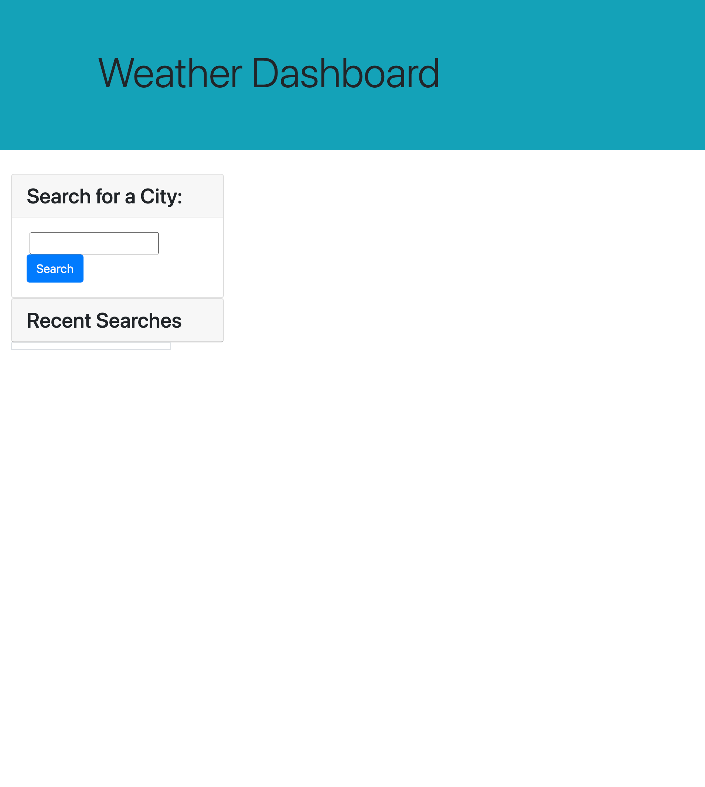

# WeatherDashboard_VGUTIERREZ

## Summary

Week 6 Homework - Weather dashboard

In this project, I built a weather dashboard that displays the current weather of a city that is inputted in the form.

This project uses html, css and javascript elements. Bootstrap is used in order to build the html format. Moment.js is used in order the help display time/date functions.

## Technologies Used

[Foundation](https://get.foundation/)  
[Moment.js](https://momentjs.com/)

Server-side APIs 
[OpenWeatherAPI](https://openweathermap.org/api/one-call-api)  

## Weather Dash Mock Up

Here is a mockup of the page:

## Link To Application

[Deployed Web Page](https://vinetteg.github.io/WeatherDashboard_VGUTIERREZ/)  
[Repo](https://github.com/vinetteg/WeatherDashboard_VGUTIERREZ)
